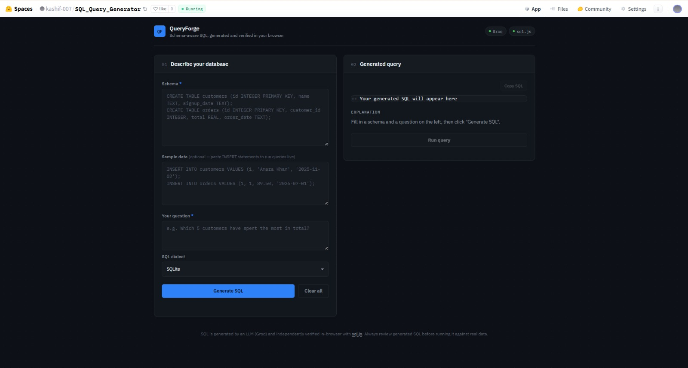
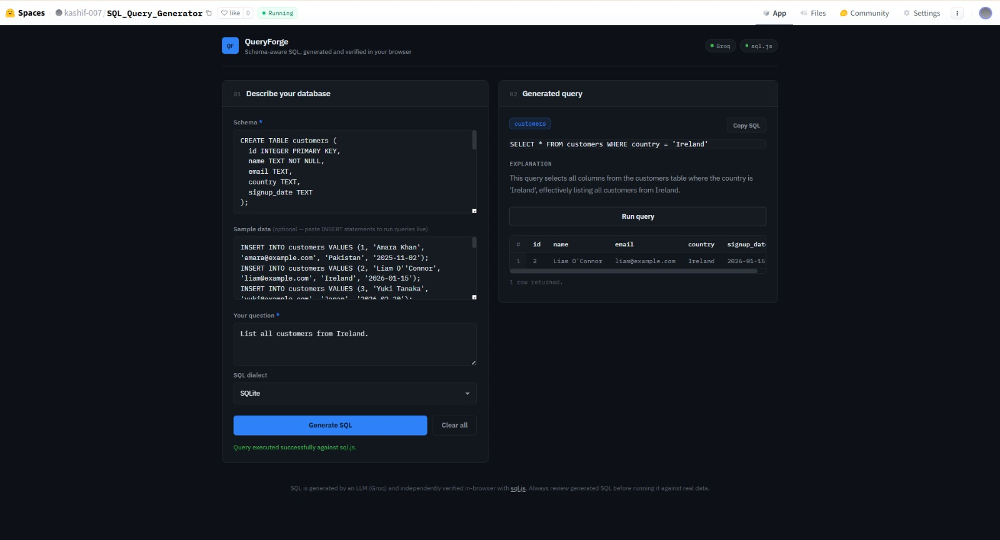

# QueryForge

Schema-aware SQL generator. Paste a schema and ask a question in plain English, Groq generates the SQL, and sql.js (SQLite via WebAssembly) actually runs it in your browser to verify it, instead of just trusting the model's output.

Full project details, features, and usage are in [PROJECT.md](./PROJECT.md). This file is just the git/GitHub setup side — getting these files onto GitHub properly.

Assumes you've got `index.html`, `script.js` and `PROJECT.md` locally.

<!--
  Add your screenshots to a `screenshots/` folder in the repo root, then
  update the paths below to match your actual filenames. Delete this
  comment once done.
-->




## Prereqs

- Git installed (`git --version`)
- A GitHub account
- `gh` CLI if you want it, not required

## Create the repo

Either use [github.com/new](https://github.com/new) (name it `queryforge`, pick public or private, don't check any of the README/gitignore/license boxes since we're adding those ourselves), or from the terminal:

```bash
gh repo create queryforge --public --source=. --remote=origin
```

## Local setup

```bash
cd queryforge
git init
git branch -M main
```

## .gitignore

No build tooling here, so just the usual clutter:

```gitignore
.DS_Store
Thumbs.db
.vscode/
.idea/
.env
.env.local
```

## LICENSE

MIT, to match what PROJECT.md says:

```
MIT License

Copyright (c) 2026 <Your Name>

Permission is hereby granted, free of charge, to any person obtaining a copy
of this software and associated documentation files (the "Software"), to deal
in the Software without restriction, including without limitation the rights
to use, copy, modify, merge, publish, distribute, sublicense, and/or sell
copies of the Software, and to permit persons to whom the Software is
furnished to do so, subject to the following conditions:

The above copyright notice and this permission notice shall be included in all
copies or substantial portions of the Software.

THE SOFTWARE IS PROVIDED "AS IS", WITHOUT WARRANTY OF ANY KIND, EXPRESS OR
IMPLIED, INCLUDING BUT NOT LIMITED TO THE WARRANTIES OF MERCHANTABILITY,
FITNESS FOR A PARTICULAR PURPOSE AND NONINFRINGEMENT. IN NO EVENT SHALL THE
AUTHORS OR COPYRIGHT HOLDERS BE LIABLE FOR ANY CLAIM, DAMAGES OR OTHER
LIABILITY, WHETHER IN AN ACTION OF CONTRACT, TORT OR OTHERWISE, ARISING FROM,
OUT OF OR IN CONNECTION WITH THE SOFTWARE OR THE USE OR OTHER DEALINGS IN THE
SOFTWARE.
```

Swap in your name.

## Before you commit: the API key

`script.js` has:

```js
const API_KEY = "PASTE_YOUR_GROQ_API_KEY_HERE";
```

Keep it as the placeholder in whatever you push. Add your real key only on the deployed copy (HF Space, Pages, wherever it's actually running), never in a commit.

If a real key does end up in a commit: revoke it at console.groq.com/keys and generate a new one. Do this first, before bothering to clean up git history. The key's already compromised once it's pushed, so scrubbing history after the fact doesn't undo that part.

## Commit and push

```bash
git add index.html script.js PROJECT.md README.md LICENSE .gitignore
git commit -m "Initial commit"
git remote add origin https://github.com/<your-username>/queryforge.git
git push -u origin main
```

(Skip the remote add if you used `gh repo create` above, it's already set.)

## Repo settings worth filling in

About panel (gear icon on the repo homepage):
- Description: "Schema-aware SQL generator Groq generates the query, sql.js verifies it live in-browser."
- Website: your deployed URL once you have one
- Topics: sql, llm, groq, sqlite, webassembly, sql-js, static-site, ai-tools

## GitHub Pages (optional)

Since it's static, you can host it here too instead of/alongside Hugging Face:

Settings → Pages → Deploy from a branch → `main`, root. Publishes to `https://<your-username>.github.io/queryforge/`.

Same API key exposure applies here as anywhere else static if you put a real key in `script.js` on the deployed copy, it's visible in page source.

## Reference

```bash
# once
git init
git branch -M main
git remote add origin https://github.com/<your-username>/queryforge.git

# every change
git add .
git commit -m "message"
git push
```
